# PredictiMed Decision Support System - Entity Relationship Diagram

```mermaid
erDiagram
    %% Account Management
    Account {
        string id PK
        string email UK
        string password
        string role
        boolean isActive
        datetime createdAt
        datetime updatedAt
        string profilePictureUrl
        boolean emailVerified
    }

    UserProfile {
        string id PK
        string accountId FK
        string fullName
        date dateOfBirth
        int age
        string gender
        string address
        string contactNumber
        string religion
        string civilStatus
        string occupation
        string educationLevel
        string philhealthNumber
        string nhtsStatus
        boolean personWithDisability
        boolean indigenousPeople
        datetime createdAt
    }

    %% Family Records
    FamilyRecord {
        string id PK
        string familyId UK "Unique Family Identifier"
        string headOfFamilyId FK "References UserProfile"
        string address
        string contactNumber
        boolean smsConsent
        datetime createdAt
        datetime updatedAt
    }

    FamilyMember {
        string id PK
        string familyRecordId FK
        string userProfileId FK
        string memberName
        string relationship
        string gender
        int age
        string occupation
        string civilStatus
    }

    FamilyHealthHistory {
        string id PK
        string familyRecordId FK
        string[] geneticConditions
        string[] chronicDiseases
        datetime recordedDate
        string recordedBy FK
    }

    %% Medical Records Categories
    MaternalHealth {
        string id PK
        string userProfileId FK
        string mothersName
        int mothersAge
        date mothersBirthday
        string mothersMaidenName
        string mothersReligion
        string mothersEducation
        string mothersOccupation
        int numberOfChildren
        string gravidaPara
        int menarcheAge
        date lastMenstrualPeriod
        date expectedDeliveryDate
        string tetanusToxoidStatus
        datetime createdAt
    }

    PrenatalVisit {
        string id PK
        string maternalHealthId FK
        date visitDate
        int gestationalAgeWeeks
        float weightKg
        float heightCm
        string bloodPressure
        float fundalHeightCm
        string fetalHeartTone
        date nextVisitDate
        string recordedBy FK
    }

    LaboratoryTest {
        string id PK
        string prenatalVisitId FK
        string userProfileId FK
        date testDate
        string testType
        boolean testCompleted
        string recordedBy FK
    }

    Intervention {
        string id PK
        string prenatalVisitId FK
        string tetanusToxoidDose
        string tetanusToxoidLocation
        date tetanusToxoidDate
        boolean ironSupplementation
        string ironMedication
        boolean vitaminSupplementation
        string vitaminMedication
        boolean calciumSupplementation
        string calciumMedication
        string[] healthEducationTopics
    }

    %% Birth Information
    BirthInformation {
        string id PK
        string userProfileId FK
        string maternalHealthId FK
        string placeOfDelivery
        time timeOfDelivery
        string deliveryType
        float birthWeightKg
        float birthHeightCm
        date newbornScreeningDate
        boolean newbornScreeningCompleted
        string feedingType
        datetime createdAt
        string recordedBy FK
    }

    %% Immunization Records
    ImmunizationEvent {
        string id PK
        string userProfileId FK
        date visitDate
        float temperatureCelsius
        float weightKg
        float heightCm
        string adverseReactions
        string healthWorkerName
        string healthWorkerSignature
        date nextFollowupDate
        string recordedBy FK
    }

    VaccineGiven {
        string id PK
        string immunizationEventId FK
        string vaccineName
        string doseNumber
        date dateGiven
        string lotNumber
    }

    %% Health Monitoring
    VitalSigns {
        string id PK
        string userProfileId FK
        date recordDate
        string bloodPressure
        int heartRate
        int respiratoryRate
        float temperatureCelsius
        int pulseRate
        string recordedBy FK
    }

    AnthropometricMeasurement {
        string id PK
        string userProfileId FK
        date measurementDate
        float weightKg
        float heightCm
        float headCircumferenceCm
        float waistCircumferenceCm
        float bmi
        string recordedBy FK
    }

    GrowthTracking {
        string id PK
        string userProfileId FK
        date trackingDate
        string weightForAge
        string heightForAge
        string weightForHeight
        string recordedBy FK
    }

    %% Visit Records
    VisitRecord {
        string id PK
        string userProfileId FK
        date visitDate
        string visitType
        string visitFrequency
        boolean referred
        string facilityName
        string referralReason
        string recordedBy FK
    }

    %% NCD Risk Assessment
    NCDRiskAssessment {
        string id PK
        string userProfileId FK
        date assessmentDate
        string smokingStatus
        string alcoholIntake
        string physicalActivity
        string fruitVegetableIntake
        boolean familyHistoryDiabetes
        boolean familyHistoryHypertension
        boolean familyHistoryHeartDisease
        boolean familyHistoryStroke
        boolean screeningCompleted
        boolean followUpNeeded
        string[] lifestyleModifications
        string[] healthEducationReceived
        string recordedBy FK
    }

    %% Healthcare Services
    HealthWorker {
        string id PK
        string accountId FK
        string name
        string role
        string contactNumber
        string signature
        boolean isActive
    }

    HealthEducation {
        string id PK
        string userProfileId FK
        string[] topicsCovered
        date dateProvided
        string providedBy FK
    }

    NutritionalCounseling {
        string id PK
        string userProfileId FK
        string recommendations
        date dateProvided
        string providedBy FK
    }

    Referral {
        string id PK
        string userProfileId FK
        string facilityName
        string reason
        date dateReferred
        string status
        string referredBy FK
    }

    %% Follow-up System
    Appointment {
        string id PK
        string userProfileId FK
        date nextVisitDate
        string visitType
        string appointmentStatus
        string scheduledBy FK
        datetime createdAt
    }

    ImmunizationReminder {
        string id PK
        string userProfileId FK
        string vaccineName
        date dueDate
        boolean reminderSent
        datetime sentAt
    }

    TestReminder {
        string id PK
        string userProfileId FK
        string testName
        date dueDate
        boolean reminderSent
        datetime sentAt
        datetime createdAt
    }

    %% Events & Seminars
    Event {
        string id PK
        string title
        string description
        string eventType
        date eventDate
        time startTime
        time endTime
        string venue
        string targetAudience
        int maxParticipants
        string status
        string bannerImageUrl
        string createdBy FK
        datetime createdAt
    }

    EventRegistration {
        string id PK
        string eventId FK
        string userProfileId FK
        date registrationDate
        string status
        string notes
    }

    %% Medical Programs
    MedicalProgram {
        string id PK
        string programName
        string description
        string programType
        date startDate
        date endDate
        string venue
        string targetDemographic
        int targetParticipants
        string status
        string bannerImageUrl
        string createdBy FK
        datetime createdAt
    }

    ProgramParticipation {
        string id PK
        string medicalProgramId FK
        string userProfileId FK
        date participationDate
        string status
        string servicesReceived
        string notes
        string recordedBy FK
    }

    %% Virtual Checkup
    VirtualCheckup {
        string id PK
        string userProfileId FK
        string healthWorkerId FK
        date scheduledDate
        time scheduledTime
        string meetingUrl
        string status
        string consultationType
        string chiefComplaint
        string notes
        int durationMinutes
        datetime createdAt
    }

    VirtualCheckupNote {
        string id PK
        string virtualCheckupId FK
        string note
        string createdBy FK
    }

    %% Inquiries
    Inquiry {
        string id PK
        string userProfileId FK
        string subject
        string message
        string priority
        string status
        string category
        datetime createdAt
    }

    InquiryResponse {
        string id PK
        string inquiryId FK
        string message
        string respondedBy FK
    }

    %% Survey System
    Survey {
        string id PK
        string title
        string description
        string surveyType
        boolean isActive
        date startDate
        date endDate
        string qrCode
        string createdBy FK
        datetime createdAt
    }

    SurveyQuestion {
        string id PK
        string surveyId FK
        string questionText
        string questionType
        string[] options
        boolean isRequired
        int orderIndex
    }

    SurveyResponse {
        string id PK
        string surveyId FK
        string userProfileId FK
        string ipAddress
        datetime submittedAt
    }

    SurveyAnswer {
        string id PK
        string surveyResponseId FK
        string surveyQuestionId FK
        string answer
    }

    %% Analytics & Reports
    AnalyticsReport {
        string id PK
        string reportName
        string reportType
        string[] dataFilters
        json reportData
        date reportPeriodStart
        date reportPeriodEnd
        string generatedBy FK
    }

    PredictionModel {
        string id PK
        string modelName
        string modelType
        json modelParameters
        json predictionResults
        float accuracy
        date lastTrained
        boolean isActive
        string createdBy FK
        datetime createdAt
    }

    %% System Logs
    SystemLog {
        string id PK
        string userId FK
        string action
        string entityType
        string entityId
        json oldData
        json newData
        string ipAddress
        string userAgent
    }

    %% Relationships
    Account ||--|| UserProfile : "has"
    Account ||--o{ HealthWorker : "can be"

    UserProfile ||--o{ FamilyMember : "can be member of"
    FamilyRecord ||--o{ FamilyMember : "contains"
    FamilyRecord ||--|| FamilyHealthHistory : "has"
    UserProfile ||--|| FamilyRecord : "heads family"

    UserProfile ||--o{ MaternalHealth : "has"
    MaternalHealth ||--o{ PrenatalVisit : "has visits"
    PrenatalVisit ||--o{ LaboratoryTest : "may have tests"
    PrenatalVisit ||--o{ Intervention : "has interventions"

    UserProfile ||--o{ BirthInformation : "has birth record"
    MaternalHealth ||--o{ BirthInformation : "related to"

    UserProfile ||--o{ ImmunizationEvent : "has immunizations"
    ImmunizationEvent ||--o{ VaccineGiven : "contains vaccines"

    UserProfile ||--o{ VitalSigns : "has vital signs"
    UserProfile ||--o{ AnthropometricMeasurement : "has measurements"
    UserProfile ||--o{ GrowthTracking : "has growth data"
    UserProfile ||--o{ VisitRecord : "has visit records"
    UserProfile ||--o{ NCDRiskAssessment : "has risk assessments"

    UserProfile ||--o{ HealthEducation : "receives education"
    UserProfile ||--o{ NutritionalCounseling : "receives counseling"
    UserProfile ||--o{ Referral : "has referrals"

    UserProfile ||--o{ Appointment : "has appointments"
    UserProfile ||--o{ ImmunizationReminder : "has reminders"
    UserProfile ||--o{ TestReminder : "has test reminders"

    Account ||--o{ Event : "creates events"
    Event ||--o{ EventRegistration : "has registrations"
    UserProfile ||--o{ EventRegistration : "registers for events"

    Account ||--o{ MedicalProgram : "creates programs"
    MedicalProgram ||--o{ ProgramParticipation : "has participants"
    UserProfile ||--o{ ProgramParticipation : "participates in programs"

    UserProfile ||--o{ VirtualCheckup : "schedules checkups"
    HealthWorker ||--o{ VirtualCheckup : "conducts checkups"
    VirtualCheckup ||--o{ VirtualCheckupNote : "has notes"

    UserProfile ||--o{ Inquiry : "creates inquiries"
    Inquiry ||--o{ InquiryResponse : "has responses"

    Account ||--o{ Survey : "creates surveys"
    Survey ||--o{ SurveyQuestion : "has questions"
    Survey ||--o{ SurveyResponse : "has responses"
    SurveyResponse ||--o{ SurveyAnswer : "has answers"
    UserProfile ||--o{ SurveyResponse : "submits responses"

    Account ||--o{ AnalyticsReport : "generates reports"
    Account ||--o{ PredictionModel : "creates models"

    Account ||--o{ SystemLog : "has activity logs"
```

## Database Schema Overview

This ERD represents the comprehensive database structure for the PredictiMed Decision Support System, designed to support:

### Core Features:

-   **Account Management**: Multi-role user authentication and profiles
-   **Medical Records**: Comprehensive health data tracking for trend analysis
-   **Family Health Records**: Family-based health information management
-   **Maternal & Child Health**: Prenatal care, birth records, and immunization tracking
-   **Health Monitoring**: Vital signs, growth tracking, and NCD risk assessment
-   **Events & Seminars**: Healthcare event management system
-   **Medical Programs**: Mass health program coordination
-   **Virtual Checkup**: Telemedicine consultation platform
-   **Inquiries**: User-admin communication system
-   **Survey System**: QR code-enabled data collection
-   **Analytics & Reports**: Decision support and predictive modeling
-   **System Monitoring**: Comprehensive audit trail and logging

### Key Relationships:

-   Each **Account** has one **UserProfile** with detailed demographic information
-   **UserProfiles** can belong to **FamilyRecords** for household health tracking
-   **MaternalHealth** records link to **PrenatalVisits** and **BirthInformation**
-   **ImmunizationEvents** track multiple **VaccinesGiven** per visit
-   **Surveys** support multiple **SurveyQuestions** with flexible **SurveyResponses**
-   **Analytics** and **PredictionModels** enable trend analysis and forecasting

### Design Principles:

-   **Trend-Focused**: All models designed for time-series analysis rather than diagnostic decisions
-   **Audit-Ready**: Complete change tracking for all medical records
-   **Scalable**: Optimized for large datasets and complex queries
-   **Flexible**: Supports various health programs and data collection methods
